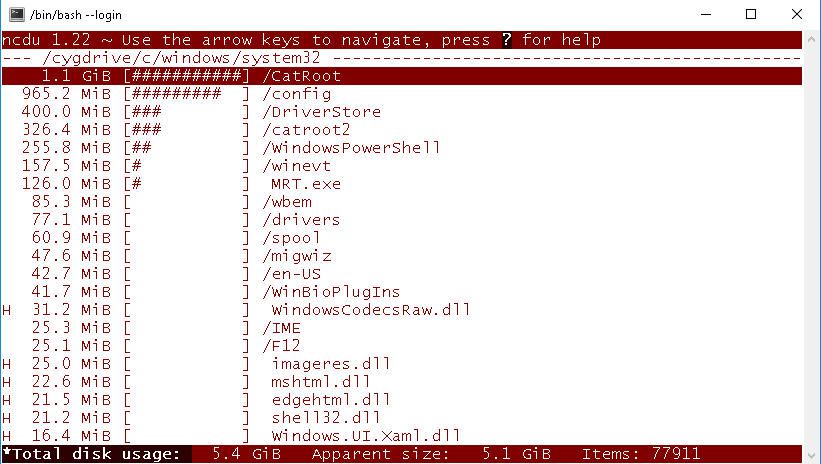

# wincdu - Ncdu for Windows

wincdu is a packaging of Ncdu for Windows systems. It provides a self-contained Cygwin-based environment with Ncdu and Mintty terminal emulator already included, offering a ready-to-use disk usage analyzer for Windows.

## Features

- **Complete Ncdu implementation**: Full-featured NCurses Disk Usage analyzer for Windows
- **Interactive interface**: Navigate and browse disk usage with an intuitive text-based interface
- **Fast scanning**: Quick recursive directory scanning for disk space analysis
- **Visual overview**: Sorted, interactive list showing file and directory sizes
- **File management**: Delete files and directories directly from the interface
- **Lightweight**: Efficient and fast disk usage analysis
- **Bundled terminal**: Includes Mintty terminal emulator for optimal user experience
- **Portable**: Unzip and run, no installation or system modifications required
- **Cygwin integration**: Includes Cygwin runtime for Linux-like environment on Windows

## Requirements

- Windows Vista or later
- No external dependencies required — all components included in the package

## Download

Latest releases of wincdu are available on GitHub:

https://github.com/itefixnet/wincdu/releases

Each release includes:
- The complete wincdu ZIP package (Ncdu, Mintty, Cygwin runtime)
- Release notes and version history

## Basic Usage

1. Unzip the downloaded archive

2. Start the wincdu environment:
   ```
   wincdu.cmd
   ```
   This will launch a suitable Mintty terminal

3. Start ncdu with the directory to be scanned as parameter:
   ```
   ncdu /cygdrive/c/work
   ```
   
   Note: Use Cygwin naming conventions — Windows path `c:\work` becomes `/cygdrive/c/work`

4. Navigate the interface:
   - Use arrow keys to browse directories
   - Press Enter to enter a directory
   - Press 'd' to delete selected files/directories
   - Press 'q' to quit

wincdu is tested successfully with local directories. You should test and verify that it works for your specific needs.

## Links

- **Ncdu homepage**: https://dev.yorhel.nl/ncdu
- **Mintty homepage**: https://mintty.github.io/
- **Cygwin homepage**: http://www.cygwin.com/

## License

wincdu is licensed under the BSD 2-Clause License. See LICENSE file for details.
